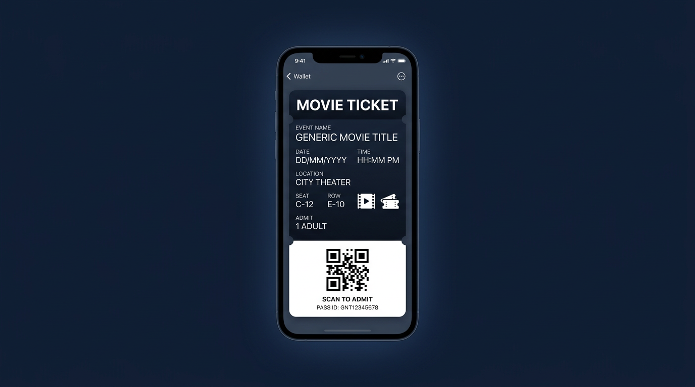
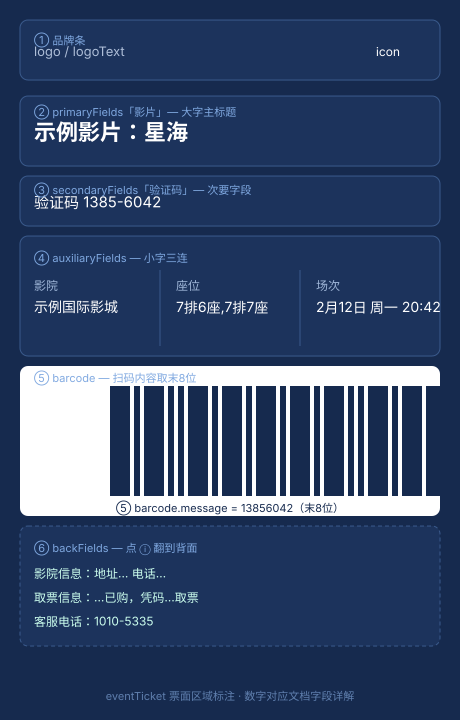

# Apple Wallet `.pkpass` 字段实战指南

一份从零讲清楚 `.pkpass` 里每个字段到底干什么、在票面上呈现什么效果、有哪些坑的资料。所有结论都来自真机验证，不是照抄 Apple 文档。

> 本文档用于技术学习。随附的示例模板不含任何第三方品牌标识（icon/logo 均为占位图），仅用来演示字段效果，不牵涉任何商业票务平台的视觉资产。



## 你拿到手的是什么

`.pkpass` 本质是个 zip 包，里面一份 `pass.json`、几张图片、一个 `manifest.json`。iOS 的 Wallet 读这个包，按 `pass.json` 把票渲染出来：

```
xxx.pkpass/
├── pass.json          # 核心数据
├── manifest.json      # 每个文件的 SHA-1 清单
├── icon.png / icon@2x.png
├── logo.png / logo@2x.png
└── thumbnail.png / thumbnail@2x.png
```

改了任何内容之后，必须重算 `manifest.json` 里对应文件的 SHA-1，否则 iOS 添加时直接报"凭证无效"拒收。后面给的 `build_pass.py` 就是干这个的。

## 免签壳：不签名也能加进 Wallet

正常情况 `.pkpass` 需要开发者证书签名（`signature` 文件）才能被 Wallet 接受。但 iOS 自带一个 "Create a Pass" 功能，它用自己的身份 `com.apple.wallet` 生成 pass。我们借用这个身份：把 `teamIdentifier` 写成 `com.apple.wallet`，`passTypeIdentifier` 写成 `userpass.com.apple.wallet.<uuid>`，再剥掉 `webServiceURL` 和 `authenticationToken`，iOS 就把它当成"系统自己出的票"放行——不需要任何证书。

代价是没有服务器推送（推送靠 APNs 证书，而证书绑定开发者账号，免签拿不到），通知只能走本地触发字段。

## 字段全景



票面内容都挂在 `eventTicket` 这个对象下，按区域分了几组 field。下面逐个讲。

## 身份字段（必填）

缺一个都加不进去：

- `formatVersion`：写死 `1`，目前只有这一个值。
- `teamIdentifier`：免签壳固定 `com.apple.wallet`。物理限制，不能改回真实 Team ID，改了 iOS 不认。
- `passTypeIdentifier`：`userpass.com.apple.wallet.<uuid>`。每次生成换个 uuid，避免和已有 pass 冲突。
- `serialNumber`：同一 `passTypeIdentifier` 下不能重复。想让新票覆盖旧票就保持 serialNumber 不变，否则每次随机。真实猫眼用 `t.` 前缀（如 `t.23325946120`），纯属风格，无功能含义。
- `organizationName`：列表和锁屏通知里显示的组织名（"来自 XXX 的票券"）。
- `description`：无障碍朗读用，也出现在列表辅助文字。Apple 建议格式 `{类型}：{标题} - {地点} {时间}`，例如 `电影票：星海 - 示例国际影城 2月12日`。

## 外观

- `backgroundColor` / `foregroundColor` / `labelColor`：背景色、文字色、标签色，都是 `rgb(r,g,b)` 字符串。这三个只决定画在图片之外的文字颜色，**不影响图片本身的像素**。

## 条码

- `barcode`（单对象）和 `barcodes`（数组，iOS 9+ 多格式降级）二选一，至少得有一个，否则添加时警告。
- `format` 支持 QR / Aztec / Code128 / PDF417，电影票基本都是 QR。
- `message` 是扫码后得到的内容。这里有个**真实规律**值得记：猫眼原版里，取票码超过 8 位时，二维码只取**末 8 位**，不超过就取完整。例如取票码 `4107420189672635` → 二维码 `89672635`。所以照着原版填时，二维码和票面显示的验证码不是同一个字符串。
- `messageEncoding` 固定 `"UTF-8"`。
- `altText`（可选）：扫码区下方的小字，无障碍朗读用。

## 票面内容：`eventTicket`

`eventTicket` 下分五个 section，Wallet 按固定优先级排布：

| section | 角色 | 数量 | 说明 |
|---|---|---|---|
| `headerFields` | 堆叠时可见 | ≤3 | 多张票叠在一起时只有这块露出来 |
| `primaryFields` | 主标题 | 1~2 | 最大字号，通常放片名 |
| `secondaryFields` | 次要 | 1~2 | 略小，放验证码 |
| `auxiliaryFields` | 辅助 | ≤5 | 小字三连，放影院/座位/场次 |
| `backFields` | 背面 | 不限 | 点 ⓘ 翻面看，放地址/电话/说明 |

每个字段结构统一：

```json
{ "key": "唯一键", "label": "标签", "value": "显示内容" }
```

`key` 是给你自己定位用的，`label` 才是用户看到的（"影片""座位"那几个小字）。

**字体缩放陷阱**：Wallet 按字段内容长度自动缩放字号。同一张模板，座位写 `7排6座` 和写 `4厅激光厅 7排6座、7排7座、7排8座`，后者会被压小一截。这不是 bug，是渲染策略——文字越长字越小。想字大就缩短内容，代价是信息变少。

**背面跳地图不用 locations**：在 `backFields` 里写一段真实地址文字（如 `地址：示例市示例路1号`），iOS 的 Data Detectors 会自动把它变成蓝色可点链接，点了跳 Apple 地图。电话、网址同理。完全不需要 `locations` 坐标，也不影响列表显示。

## 时间相关

- `expirationDate`：过期时间，ISO 8601。过了这个点 Wallet 自动归档（变灰）。真实电影票一般设成"场次结束 + 影片时长"（约 +2h）。
- `passThatWasSet`：这张票"被设置"的时间。猫眼原版里它不是时间戳字符串，而是**整张票字段的快照对象**（把 `eventTicket` 整个塞进去）。实测对象格式可用，照做即可。

## 本地触发（通知的唯一路径）

免签没有服务器推送，锁屏通知全靠这几个字段：

- `relevantDate`：到点附近弹通知，最重要。
- `locations`：GPS 坐标 + `relevantText`。进入范围弹通知，同时**会让列表/归档视图反查出城市名**（如"新乡市，河南省"）。不想显示城市就别加它。
- `maxDistance`：`locations` 的触发半径（米）。
- `beacons`：iBeacon 触发，需要现场部署硬件，一般用不上。
- `ignoresTimeZone`：固定场次建议 `true`，否则跨时区显示会自动换算，用户会懵。

## 语义集成：`semantics`

`semantics` 告诉 iOS"这是一张电影票"而不只是张图。设了之后自动获得：日历建事件、地图建议、Siri 提醒。结构大致：

```json
{
  "eventTicket": {
    "eventStartDate": "2024-02-12T20:42:00Z",
    "eventEndDate": "2024-02-12T22:30:00Z",
    "eventType": "movie",
    "venue": { "name": "示例国际影城", "location": {"latitude": 35.1, "longitude": 114.2} }
  }
}
```

`eventType` 有 `movie` / `concert` / `sport` / `generic` 等预定义值。`venue.location` 同样会触发列表城市反查，介意的话把 `location` 去掉即可（日历和类型集成不依赖坐标）。

## 杂项字段

- `groupingIdentifier`：相同值的票在 Wallet 里自动分组。不能含空格，否则拒收。
- `appLaunchURL`：点票跳转的 URL，必须有 `https://` 头。
- `associatedStoreIdentifiers`：关联 App Store 应用 ID，装了对应 App 就在票上显示打开按钮，纯展示用。
- `userInfo`：任意 JSON，不显示，给调用方读取。
- `sharingProhibited`：`true` 时禁用分享按钮。
- `voided`：`true` 时票面打灰水印，标记已使用。

## 死刑名单（加了必炸或必无效）

| 字段 | 结论 |
|---|---|
| `webServiceURL` | 免签 + 这个 = iOS 添加时直接打不开，无论 HTTP 还是 HTTPS。服务器推送在免签下本就不可能（缺 APNs 证书），别加。 |
| `authenticationToken` | 签名链的一部分，免签下无意义，去掉。 |
| `signature` | 免签没有，manifest 的 SHA-1 就是完整性校验。 |

## 动手：用演示模板

`examples/` 下有一份去品牌的 `demo-template.pkpass`：

- `make_demo.py`：从真实电影票骨架抽取字段结构，换成占位图和中性的示例数据重新生成。想看它怎么来的就跑这个。
- `build_pass.py`：改完 `pass.json` 或图片后，用它重算 manifest。

```bash
cd examples
python make_demo.py                      # 生成 demo-template.pkpass
# 手动改 pass.json 里的 value ...
python build_pass.py demo-template.pkpass # 重算 manifest
```

把 `.pkpass` 用 AirDrop / 邮件 / 文件 App 传到 iPhone，点开就能加进 Wallet。

## 踩坑实录

`.pkpasses` 一键包的内部结构、`webServiceURL` 为什么死刑、字体缩放、`locations` 反查与 Data Detectors 的区别、barcode 末 8 位、`passThatWasSet` 的对象格式——这些实战里反复栽过的地方，单独写在 [docs/pitfalls.md](docs/pitfalls.md)。

## License

MIT。示例模板不含任何第三方品牌资产。
