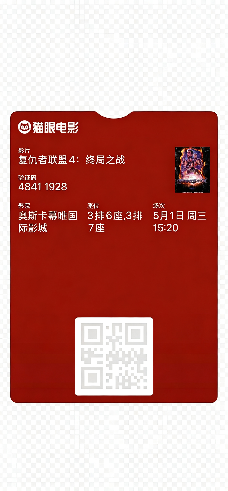

# anyWallet

> 不签名，也能进 iPhone 钱包的凭证。

一份关于 Apple Wallet `.pkpass` 文件格式的参考与去品牌模板。它只讲清楚一件事：不申请开发者账号、不签证书、不开 APNs，怎么做出一张能直接加进 Wallet 的凭证——电影票、会员卡、优惠券都行。

结论全部来自真机实测：40 多次壳实验，加上 5 个原版品牌（猫眼、万达、携程、淘票票、iTunes）逐字段比对。不照抄 Apple 文档，因为文档里那套签名流程正是我们要绕开的东西。

## 实际效果

下面是真机 AirDrop 后在 Wallet 里渲染出来的票面截图，已做精细抠图、背景透明。视觉效果即真机添加后的样子：字段全在显示区，二维码可扫，颜色与原版一致。



| 项目 | 值 |
|---|---|
| passTypeIdentifier | `userpass.com.apple.wallet.<uuid>` |
| teamIdentifier | `com.apple.wallet` |
| style | eventTicket |
| 颜色 | `rgb(133,19,10)` |
| 本地触发字段 | relevantDate + locations + beacons + ignoresTimeZone |
| 语义集成 | semantics.eventTicket（电影类型） |
| 真签名 | 无 |

## 概述

这一段给第一次来的人，三分钟看懂，细节往后翻。

**它解决什么问题**
正经做一张 Wallet 票，要走 PassKit：开发者账号 → Pass Type ID → 证书 → APNs 推送。门槛高，个人和小团队基本劝退。anyWallet 走另一条路：借 iOS 自带的 `com.apple.wallet` 系统身份当壳，只替换壳里的内容，不碰证书链。

**你能得到什么**
- 一张合法、能加进 Wallet 的 `.pkpass`
- 完整可见的票面（文字、颜色、二维码、图标）
- 本地触发的锁屏通知（到点、到地点）
- 去品牌的演示模板，字段结构和真票一致，可直接拿来改

**你不能得到什么（先有个印象）**
- 没有服务器推送（依赖 APNs 证书，免签身份拿不到）
- 不能挂 `webServiceURL`（加了 iOS 直接拒收）
- 不能做 `storeCard` 余额卡样式、不能用 `background`/`strip` 图、不能用 NFC
- 剩下所有"显示类"和"本地触发类"字段，随便填

**仓库里有什么**

| 路径 | 是什么 |
|---|---|
| `README.md` | 你正在读的这份 |
| `docs/pitfalls.md` | 实战踩坑，每条带实验数据 |
| `examples/make_demo.py` | 生成去品牌演示票 `demo-template.pkpass` |
| `examples/build_pass.py` | `rebuild()`：改完字段后重算 manifest |
| `examples/demo-template.pkpass` | 现成的去品牌样例 |
| `assets/` | 项目图标、票面区域图、真机效果图 |

## 免签壳：原理

### 概述

`.pkpass` 是个 zip，里面有 `pass.json`（数据）、若干图片、`manifest.json`（每个文件的 SHA-1 清单），以及开发者证书的 `signature`。Wallet 的正常流程是验签——签名对不上就拒收。

免签的思路是**借身份、不借证书**：iOS 自己的"创建通行证"功能用 `com.apple.wallet` 这个 Team 身份出 pass（用户在备忘录里就能干）。我们把第三方票的 `teamIdentifier` 改成 `com.apple.wallet`、`passTypeIdentifier` 改成 `userpass.com.apple.wallet.<uuid>`，删掉 `signature` / `webServiceURL` / `authenticationToken`，iOS 看到 `com.apple.wallet` 就当系统自家的票放行。

### 详细：签名链是怎么被绕开的

普通 pass 的信任来自"证书链 → 验签"。免签 pass 没有证书，它的"信任"来自 `teamIdentifier == com.apple.wallet` 这个特例——iOS 对系统自身身份跳过验签。所以：

- `teamIdentifier` 写死 `com.apple.wallet`，改回真实 Team ID 立刻不认
- `passTypeIdentifier` 必须是 `userpass.com.apple.wallet.<uuid>`，每次换 uuid 避免冲突
- `signature` 文件不存在，包完整性由 `manifest.json` 的 SHA-1 保证——够用

### 详细：代价是物理的

免签用的是 Apple 自己的身份，你**拿不到**对应 Pass Type ID 的 APNs 证书。所以服务器推送这条路从根上就走不通，不是"没调好"。通知只能退而求其次走本地触发字段（`relevantDate` / `locations` / `beacons`）。

### 详细：为什么必须重算 manifest

`.pkpass` 里任何字节变了——`pass.json` 里一个字符、任何一张图——`manifest.json` 里对应文件的 SHA-1 都得重算，否则 Wallet 添加时直接报"凭证无效"。这不是建议，是底线。`examples/build_pass.py` 的 `rebuild()` 就是干这个的。

## 能力边界：能签与不能签

### 概述

免签不是啥都能填。下面两张表是硬边界，照着填不会错。一句话记牢：**身份三键按免签规则改写、所有显示类和本地触发类字段照常填、凡是依赖证书或服务器的全删**。

### 详细：能填的字段

| 类别 | 字段 | 说明 |
|---|---|---|
| 身份 | `formatVersion` `serialNumber` `organizationName` `description` | 必填，照常 |
| 外观 | `backgroundColor` `foregroundColor` `labelColor` `logoText` | 控制文字与背景色，不动图片像素 |
| 票面 | `headerFields` `primaryFields` `secondaryFields` `auxiliaryFields` `backFields` | 所有可见文字区域 |
| 条码 | `barcode` / `barcodes` | 二选一，至少留一个 |
| 本地触发 | `relevantDate` `locations` `maxDistance` `beacons` `ignoresTimeZone` | 通知唯一路径 |
| 语义 | `semantics` | 让 iOS 把票当电影/演出/体育来对待 |
| 杂项 | `groupingIdentifier` `appLaunchURL` `associatedStoreIdentifiers` `userInfo` | 分组、跳转、关联 App、元数据 |
| 状态 | `expirationDate` `passThatWasSet` `voided` `sharingProhibited` | 过期、通知防重置、作废、禁分享 |

### 详细：碰了就炸

| 字段 | 结论 |
|---|---|
| `webServiceURL` | **死刑**。免签身份 + 这个组合在添加阶段被 iOS 硬拒，与 HTTP/HTTPS 无关（壳实验 12 轮，其中 5 轮用正经 HTTPS 地址照样失败）。根因是免签身份拿不到 APNs 证书，推送本就不可能 |
| `signature` / `authenticationToken` | 跟证书链绑定，免签下无意义，删 |
| `storeCard` 样式 | 免签渲染器拒收，做余额卡得换成 `eventTicket` 或 `generic` |
| `background.png` / `strip.png` | 免签渲染器直接丢弃 |
| `nfc` | 仅 `boardingPass` / `storeCard` 支持，`eventTicket` 用不了 |
| `transitType` | `boardingPass` 专用 |

## 字段参考

这一节是手册主体，按类别逐个讲。每个字段给：类型、必填、含义、免签下状态。

### 身份字段

- `formatVersion` — 整数，必填，写 `1`。
- `teamIdentifier` — 字符串，必填，免签固定 `com.apple.wallet`。
- `passTypeIdentifier` — 字符串，必填，格式 `userpass.com.apple.wallet.<uuid>`。同一 PTI 下 `serialNumber` 不可重复。
- `serialNumber` — 字符串，必填，同 PTI 下唯一。猫眼原版用 `t.` 前缀，纯风格无功能含义。
- `organizationName` — 字符串，必填，锁屏与列表里的组织名。
- `description` — 字符串，必填，VoiceOver 朗读用，也出现在列表辅助文字。建议 `{类型}：{标题} - {地点} {时间}`。

### 外观

- `backgroundColor` / `foregroundColor` / `labelColor` — `rgb(r,g,b)`，可选。**只影响画在图片之外的文字，不动图片像素**。想改 icon/logo/thumbnail 颜色那是图片自己的事。
- `logoText` — 字符串，可选，logo 图旁的替代文字。

### 条码

- `barcode`（单对象）与 `barcodes`（数组，iOS 9+ 多格式降级）二选一，至少留一个。`format` 支持 QR / Aztec / Code128 / PDF417，电影票基本是 QR。`message` 是扫码内容，`messageEncoding` 固定 `"UTF-8"`，`altText` 可选（扫码区下方小字）。

  真坑：**票面显示的验证码和二维码内容可以不是同一串**。猫眼原版里取票码超过 8 位时，二维码只取末 8 位（票面 `4107420189672635`、二维码 `89672635`），不超 8 位才取完整。生成时：

  ```python
  raw = re.sub(r"[\s-]", "", code)
  message = raw[-8:] if len(raw) > 8 else raw
  ```

### 票面内容：`eventTicket`

所有可见文字挂在 `eventTicket` 下，按区域分五个 section，Wallet 自动排版：

| section | 角色 | 数量 | 干啥用 |
|---|---|---|---|
| `headerFields` | 堆叠时可见 | ≤3 | 多张票叠一起时只有这块露出来，建议填 |
| `primaryFields` | 主标题 | 1~2 | 最大字号，通常放片名 |
| `secondaryFields` | 次要 | 1~2 | 略小，放验证码 |
| `auxiliaryFields` | 辅助 | ≤5 | 小字三连，放影院/座位/场次 |
| `backFields` | 背面 | 不限 | 点 ⓘ 翻面，放地址/电话/说明 |

每个字段结构：`{ "key": "唯一键", "label": "标签", "value": "显示内容" }`。`key` 给自己定位，`label` 才是用户看到的小字标题。区域排版见 `assets/field-layout.svg`。

两个常栽的坑：

- **字体缩放**：Wallet 按字段内容长度自动缩字号。座位写 `7排6座` 和写 `4厅激光厅 7排6座、7排7座、7排8座`，后者会被压小一截。这不是 bug，是渲染策略。想字大就缩短文字。
- **背面跳地图不需要 `locations`**：在 `backFields` 写真实地址文字，iOS Data Detectors 自动变蓝色可点链接跳地图。完全不用坐标，也不影响列表城市反查——后者只认 `locations` 和 `semantics.venue.location`。

### 本地触发（通知唯一路径）

- `relevantDate` — W3C 时间，到点附近锁屏弹通知，最重要。
- `locations` — `[{latitude, longitude, relevantText}]`，进入范围弹通知，同时让列表/归档反查出城市名。不想显城市就别加。
- `maxDistance` — 整数（米），`locations` 触发半径。
- `beacons` — iBeacon 触发，需现场硬件。
- `ignoresTimeZone` — 布尔，固定场次建议 `true`，否则跨时区会自动换算。

### 语义集成：`semantics`

让 iOS 知道"这是张电影票"而非一张图，自动获得日历建事件、地图建议、Siri 提醒。结构：

```json
{
  "eventTicket": {
    "eventStartDate": "2024-02-12T20:42:00Z",
    "eventEndDate": "2024-02-12T22:30:00Z",
    "eventType": "movie",
    "venue": { "name": "示例国际影城", "location": {"latitude": 35.1, "longitude": 114.2} }
  }
}
```

`eventType` 有 `movie` / `concert` / `sport` / `generic` 等。**嵌套在 `eventTicket` 下**，误把整个 `semantics` 塞顶层会触发字段级防火墙导致打不开（壳实验确认）。`venue.location` 同样会触发列表城市反查，介意就去掉 `location`（日历与类型集成不依赖坐标）。

### 过期与状态

- `expirationDate` — W3C 时间，过了点自动归档变灰。电影票一般设"场次结束 + 影片时长"约 +2h。别写死到 2027 年，免签没外部系统帮你作废，过期还在列表晃很碍眼。
- `passThatWasSet` — `eventTicket` 对象的快照（不是时间戳字符串）。填原版字段的深拷贝即可，值设成过去时间（生成时刻 −24h），避免 iOS 认为"刚更新"而重置通知设置。早期试过时间戳字符串和 `{datetime, timestamp}` 对象，实测都无效。
- `voided` — 布尔，`true` 时票面打灰水印、通知禁发。
- `sharingProhibited` — 布尔，`true` 禁用分享，防含取票码的票被转出去。

### 隐私与跳转

- `userInfo` — 任意 JSON，不显示，给调用方读（订单号、用户 ID、时间戳）。
- `appLaunchURL` — 点票跳转 URL，**必须有 `https://` 头**，否则拒收。
- `groupingIdentifier` — 同值自动分组，**不能含空格**，否则拒收。
- `associatedStoreIdentifiers` — 关联 App Store 应用 ID，装了对应 App 就显示打开按钮，纯展示，与推送无关。

## 动手：去品牌模板

### 概述

`examples/` 让你零基础上手：一条命令生成一张去品牌、字段结构真实的电影票；改完字段后用另一条命令重算 manifest。

### 详细：`make_demo.py` 生成演示票

读取骨架 `开发/maoyan_web_template.json`，把颜色换成中性深蓝、组织名改成 "Demo Pass"、内容换成示例数据，**字段结构、key/label、布局与真实电影票完全一致**，但没有任何品牌标识。

```bash
python examples/make_demo.py
# 产物：examples/demo-template.pkpass（含 6 张占位图 + pass.json + manifest.json，manifest 已重算）
```

生成后会自动校验 manifest 自洽。

### 详细：`build_pass.py` 重算 manifest

改完 `pass.json` 或任何图片后，必须重算 manifest，否则 Wallet 拒收。`rebuild(path)` 读原包、对每个非 `signature` 文件算 SHA-1、重写 `manifest.json`、原地替换：

```bash
python examples/build_pass.py examples/demo-template.pkpass
# 也可以当库用：from build_pass import rebuild; rebuild("x.pkpass")
```

### 详细：基于现有工具做自己的票

仓库没有"自动换壳任意品牌"的脚本——设计上也不该有：免签对额外字段容忍度不高，每张票都该照原版指纹严格填。手工流程：

1. 拿一张目标品牌的原版 `.pkpass`，解包看 `pass.json` 的真实结构（顶层键、样式、`eventTicket` 各 section 的 key/label）。
2. 改写身份三键：`teamIdentifier=com.apple.wallet`、`passTypeIdentifier=userpass.com.apple.wallet.<uuid>`。
3. 删除 `webServiceURL` / `signature` / `authenticationToken`。
4. 只改 `field.value`，**不新增原版没有的字段**，不碰致命区。
5. 若有图片改动，跑 `python examples/build_pass.py xxx.pkpass` 重算 manifest。
6. 真机 AirDrop 验证（见下节）。

想做去品牌演示，直接改 `开发/maoyan_web_template.json` 骨架后重跑 `make_demo.py` 即可，不必从零来。

## 真机验证清单

把 `.pkpass` 用 AirDrop / 邮件 / 文件 App 传到 iPhone，点开加进 Wallet。逐项确认：

- 能否正常添加（不报错即过）
- 颜色、文案、二维码是否正常
- 锁屏是否在 `relevantDate` 附近弹通知（详情页 ⓘ 里看通知开关在不在）
- 点 ⓘ 背面信息是否完整
- 列表是否如预期显/不显城市（取决于 `locations`）
- 过期时间到点后是否自动归档

前三条任一挂了，回头查 `manifest.json` 的 SHA-1 和本地触发字段格式。

## 免责声明

文中截图与示意图（含图 1 实际效果图）来自真机实测渲染，**仅作字段效果与呈现形式的参考**。实际添加至 Wallet 后的显示效果可能因以下因素存在差异：

- iOS / Wallet 版本差异（不同版本对字段渲染、字体缩放、通知触发策略可能不一）
- 设备差异（屏幕尺寸、缩放设置、可访问性选项）
- 票面字段内容差异（字段长度、字符集直接影响字体缩放与排版）
- 模板与字段组合差异（同一字段在不同布局下表现可能不同）
- 网络与时区差异（影响 `locations` 反查、`relevantDate` 触发时间）

本项目及文档涉及的票面样式、字段取值均**用于技术研究与字段效果演示**，不涉及任何商业票务平台的实际运营。文末展示的猫眼票面示例仅作免签壳机制下的渲染效果参考，与对应品牌实际产品、运营策略无关。如用于商业用途，请自行评估合规风险。

## License

MIT。
